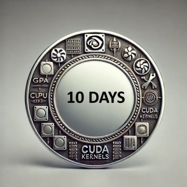

# 100 days of CUDA challenge

The challenge started in our [Discord channel](https://discord.gg/4Tg4TkJQzE).

Official onboarding guide:

- Join the [Discord channel](https://discord.gg/4Tg4TkJQzE) and announce you are starting the challenge.
- Read PMPP (Programming Massively Parallel Processors) if you never heard of CUDA.
- Check the repos of Lynn and Hamdi for inspiration: https://github.com/1y33/100Days and https://github.com/a-hamdi/cuda/
- Both Lynn and Hamdi had ZERO knowledge when they started.
- Deliver code consistently for 100 days without any gap. Every 10 day you can claim a badge.
- Write in your repo what you did every day (e.g. Day 1: I coded a kernel that adds two vectors).
- No code, no badge, no challenge.
- It doesn't matter what kernel you code, just code.
- Don't ask me if you will get a job with CUDA. Pray Lord Jensen Huang (🙏 ) every morning and you'll land one.
- If your girlfriend/boyfriend broke up with you, it's a good reason to start coding. It eases the pain.
- Don't complain you slept only 4 hours today, be happy you have 20 hours to code CUDA kernels.

### I deserve a badge, how do I get one?

Announce your repo in the Discord channel and we will verify if you actually delivered high quality code consistently. If you did, your name will appear here.

## List of active challanges

| Name                | Repository                                         |
| ------------------ | ------------------------------------------------- |
| 1y33               | [Link](https://github.com/1y33/100Days)           |
| a-hamdi            | [Link](https://github.com/a-hamdi/cuda)           |
| arcAman07            | [Link](https://github.com/arcAman07/100-Days-of-GPU-Programming)           |
| AnkitTsj            | [Link](https://github.com/AnkitTsj/cuda_learning)           |
| AramBughdaryan     | [Link](https://github.com/AramBughdaryan/cuda)     |
| aryagxr     | [Link](https://github.com/aryagxr/cuda)     |
| ashwin3005         | [Link](https://github.com/ashwin3005/CUDA)         |
| asrjy         | [Link](https://github.com/asrjy/gpu)         |
| bhavyashahh         | [Link](https://github.com/bhavyashahh/nexus-ai/tree/main/projects/bhavya-100-days-of-cuda/)         |
| derekdeming        | [Link](https://github.com/derekdeming/tinyCuda)    |
| Firojpaudel        | [Link](https://github.com/Firojpaudel/100_days_of_CUDA) |
| hkproj             | [Link](https://github.com/hkproj/100-days-of-gpu/) |
| harshkumarchourasia| [Link](https://github.com/harshkumarchourasia/100DaysOfGPU) |
| johannn05 | [Link](https://github.com/johannn05/100DaysCUDA/) |
| khushwant04        | [Link](https://github.com/khushwant04/100-Days-CUDA) |
| kmohan321          | [Link](https://github.com/kmohan321/CUDA)           |
| mathysgrapotte          | [Link](https://github.com/mathysgrapotte/100DaysCUDA/)           |
| Meeex2          | [Link](https://github.com/Meeex2/cuda/)           |
| MoAbbasid          | [Link](https://github.com/MoAbbasid/100DaysCUDA/)           |
| nevernever69       | [Link](https://github.com/nevernever69/100-days-of-cuda) |
| Noman-Ali-Bajwa       | [Link](https://github.com/Noman-Ali-Bajwa/100-days-of-cuda/) |
| PredictiveManish   | [Link](https://github.com/PredictiveManish/100days) |
| prateekshukla1108  | [Link](https://github.com/prateekshukla1108/100-daysofcuda) |
| psvkaushik         | [Link](https://github.com/psvkaushik/100_Days_CUDA) |
| rajneel18          | [Link](https://github.com/rajneel18/100_CUDA_Kernels) |
| redrodeo03          | [Link](https://github.com/redrodeo03/cuda-kernels/) |
| RookieLiao         | [Link](https://github.com/RookieLiao/tiny-cuda-examples) |
| sanjivch           | [Link](https://github.com/sanjivch/100-days-of-gpu) |
| saurav997          | [Link](https://github.com/saurav997/100DaysOfCuda) |
| ShlokVFX         | [Link](https://github.com/ShlokVFX/100-days-cuda/)   |
| SwekeR-463         | [Link](https://github.com/SwekeR-463/100kernels)   |
| vectorquantized    | [Link](https://github.com/vectorquantized/100daysofcuda) |
| ysurs    | [Link](https://github.com/ysurs/cuda-100-days) |
| zmusaddique        | [Link](https://github.com/zmusaddique/100daysCUDA) |

## Participants (10 days badge)

| Name    | Repository                               | Start date |
| ------- | ---------------------------------------- | ---------- |
| 1y33    | [Link](https://github.com/1y33/100Days)  | 2025-01-17 |
| a-hamdi | [Link](https://github.com/a-hamdi/cuda/) | 2025-01-17 |

## Participants (20 days badge)

If you push yourself a bit more, you can get here

## Participants (30 days badge)

How about not thinking and just coding?

## Participants (40 days badge)

It's just a matter of time

## Participants (50 days badge)

It's fine if your professors never believed in you, we do

## Participants (60 days badge)

How about you code a kernel that does something you never did before?

## Participants (70 days badge)

Do you want to spend your life think about coding or just code?

## Participants (80 days badge)

Jensen Huang would be proud of you

## Participants (90 days badge)

It's like a marathon, but with CUDA

## Participants (100 days badge)

You are now a CUDA warrior
